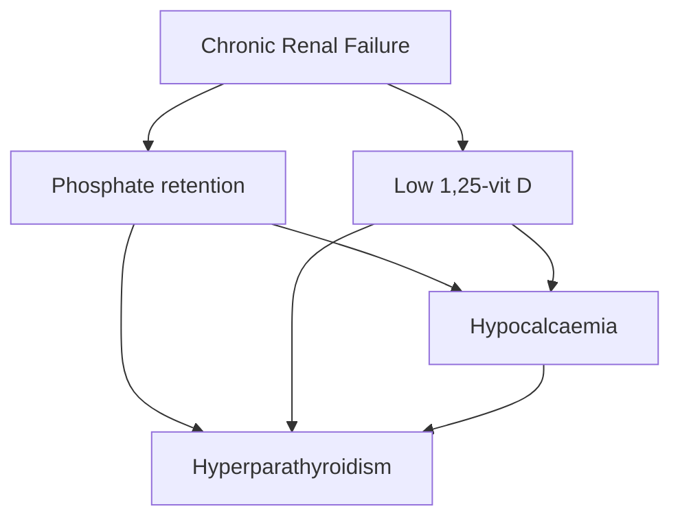

# Chronic Kidney Disease & Dialysis

> 📘 **How to use:** Each `Q:` is a Notion toggle — read the question, answer aloud, then expand. **Bold** = exam keyword. ⭐ = lecturer-emphasised. ⚠️ = trap. 🧠 = reusable reasoning pattern. Figures live in the companion PDF; filenames inline (`📎 Figure LX.Y`). Lecturer's voice signals are from the CKD lecture transcript only — Lecture 2 has no transcript and is built from slides alone.

## Lecturer's voice

**Flagged as exam-critical**
- ↓ insulin requirement in advanced CKD — *"you'll see this in finals — ESRF cures diabetes"*
- Hyperkalaemia ECG progression order — *"the classic signs"*
- KFRE inputs — *"please write this down"*
- A CKD patient dies of cardiovascular disease, not end-stage renal failure (returned to 3×)
- **Hyponatraemia ≠ low total body sodium** — *"do the fluid assessment"*

**De-emphasised**
- Memorising the eGFR equations — *"use the online calculator"*
- The race-correction factor in CKD-EPI — *"we don't use this anymore"*
- The eGFR number above 60 — inaccurate; track creatinine **trend** instead

**Spent disproportionate time on**
- Cardiovascular risk in CKD — returned to from multiple angles across the lecture
- *"First question is always: what is their fluid status?"* — repeated mantra
- The 4-function kidney frame — explicit lecture-wide scaffold

---

## Lecture 1 — CKD: the mechanism spine

🧠 **Reusable reasoning frame for every renal case stem.** (1) Pick the failed function — homeostatic / endocrine / excretory / glucose. (2) For each, predict the abnormality (e.g. homeostatic loss → ↑K, ↓HCO₃, fluid imbalance). (3) Match abnormality to the patient's symptoms — that gives you both the differential and the management.

### Q: What are the 4 functional categories of the kidney?

- **Excretory** — nitrogenous waste, hormones, peptides, "middle-sized molecules" (2–5000 Da), salt and water
- **Homeostatic** — electrolyte balance, acid-base balance, volume homeostasis
- **Endocrine** — erythropoietin, 1α-hydroxylase (active vit D production)
- **Glucose** — gluconeogenesis, insulin clearance

### Q: What determines the clinical presentation of kidney failure?

**Rate of deterioration > cause.** A creatinine of 1000 with peptic adaptation may walk in; a creatinine of 200 falling acutely may collapse. **Pattern:** chronic adapted → minimal symptoms; acute or acute-on-chronic → severe symptoms.

### Q: What is the predicted homeostatic-failure profile?

- ↑ **Potassium**
- ↓ **Bicarbonate**, ↓ **pH**
- ↑ **Phosphate**
- Salt/water imbalance (usually retention; loss in tubulointerstitial disease)

### Q: What is the predicted endocrine-failure profile?

- ↓ Erythropoietin → **anaemia**
- ↓ 1α-hydroxylase → ↓ active vit D → ↓ Ca²⁺ → ↑ **PTH**

### Q: What is the predicted excretory-failure profile?

- ↑ Urea, ↑ creatinine
- ↓ **Insulin requirement** (kidney clears insulin → less is needed)
- Lethargy, anorexia (uraemia)

⭐ **Diabetics with end-stage CKD often need much less insulin — sometimes none. The lecturer's exam phrase: *"ESRF cures diabetes."* Classic finals stem.**

## Salt & water in CKD

### Q: Why does CKD usually cause hypertension and oedema?

Failed kidneys reduce salt/water excretion → fluid retention → **hypertension, peripheral oedema, pulmonary oedema**.

### Q: When does CKD cause hypovolaemia instead?

In **tubulointerstitial disease** the concentrating mechanism is damaged → kidneys lose salt and water rather than retaining it. Hypovolaemia can then itself cause an AKI on top of the CKD.

⚠️ **Hyponatraemia ≠ low total body sodium.** It's a free-water problem, not a salt problem. The fix is fluid balance, not giving sodium. Always do the volume assessment first.

## Acidosis in CKD

```
                            (RR ↑)
                              ↓
  ↓ CO₂ + H₂O  ⇌  H₂CO₃  ⇌  HCO₃⁻ + H⁺ ↑
       ←——— blow off CO₂ to compensate ———
```

### Q: Two reasons CKD produces metabolic acidosis?

- Reduced **excretion of H⁺** by failing tubules
- **Retention of acid bases** (sulphate, phosphate from protein metabolism)

### Q: Why does acidosis cause hyperkalaemia?

H⁺ is buffered intracellularly by entering cells; to maintain electroneutrality, **K⁺ exits cells** into plasma. Net effect: serum K⁺ rises even before tubular failure adds to it.

### Q: Why is the patient hyperventilating with normal SpO₂ and clear lungs?

**Kussmaul respiration** — respiratory compensation for metabolic acidosis. ↑RR blows off CO₂, pulling the H-H equation left, lowering [H⁺]. SpO₂ stays normal because oxygenation isn't the problem; ventilation is being driven by acid load.

### Q: Two systemic effects of chronic acidosis (beyond ECG)?

- **Anorexia**
- **Muscle catabolism** (proteolysis to release alkaline amino acids)

## Hyperkalaemia

📎 Figure L1.2 — Progressive ECG changes in hyperkalaemia.

### Q: Two mechanisms by which CKD causes hyperkalaemia?

- ↓ **Distal tubule K⁺ secretion** (failed pumps; *secretion*, not filtration)
- **Acidosis** drives K⁺ out of cells

### Q: ECG progression in hyperkalaemia, in order?

1. **Peaked T waves**
2. **P wave** broadens → reduced amplitude → disappears
3. **QRS widening**
4. Heart block
5. **Sine wave / asystole / VT or VF**

### Q: Why can a chronic K⁺ of 7+ be asymptomatic?

**Chronicity allows adaptation.** Cells adjust resting membrane potential gradually. Acute rises of the same magnitude are far more dangerous. Always look at the **trend and rate**, not just the number.

### Q: Three-tier framework for hyperkalaemia management?

```
1. Drive K⁺ INTO cells       → sodium bicarbonate
                              → insulin–dextrose (caution)
                              → (β-agonists, e.g. salbutamol)
2. Drive K⁺ OUT of body      → diuretics
                              → dialysis
3. Block GUT absorption      → potassium binders (e.g. patiromer)
```

⭐ **Insulin–dextrose threshold:** give when K⁺ > 6.5 **AND** symptomatic / ECG changes. Not for asymptomatic mild rises — risk of hypoglycaemia outweighs benefit. Calcium gluconate is given separately for cardiac membrane stabilisation when ECG changes are present.

## Renal bone disease



### Q: Two routes by which CKD lowers calcium?

- **Phosphate retention** binds free Ca²⁺ → ↓ ionised Ca
- **Low 1,25-vit D** → ↓ intestinal Ca absorption

Both then drive PTH up.

### Q: Primary vs secondary vs tertiary hyperparathyroidism?

| Type | Mechanism | Calcium | PTH |
|---|---|---|---|
| Primary | Autonomous PTH (adenoma) | ↑ | ↑ |
| Secondary | Compensatory ↑PTH due to ↓Ca / CKD | ↓ or normal | ↑ |
| Tertiary | Long-standing 2° → glands become autonomous | ↑ | ↑↑ |

### Q: Why phosphate binders in CKD management?

To break the cascade at its source: lowering serum phosphate raises ionised calcium → reduces the stimulus for PTH → less bone resorption and vascular calcification.

## Cardiovascular risk — the lecture's central message

📎 Figure L1.3 — Sarnak 2019 CVD risk pyramid (event risk and fatality both rise through CKD stages).

⭐ **A patient with CKD is more likely to die from cardiovascular disease than from end-stage renal failure.** This is *the* take-home of the lecture and the most-repeated line in the transcript.

### Q: What types of CVD does CKD predispose to?

- **Atherosclerotic** — CAD, ischaemic stroke, peripheral arterial disease
- **Non-atherosclerotic** — LVH, arrhythmias, sudden cardiac death, arterial calcification, valve calcification, haemorrhagic stroke

The non-atherosclerotic burden grows disproportionately as CKD advances.

### Q: Standard vs CKD-specific cardiovascular risk factors?

- **Standard:** hypertension, diabetes, lipid abnormalities
- **CKD-specific add-ons:** inflammation, oxidative stress, mineral/bone disorder (vascular calcification)

### Q: Practical priority in the renal clinic?

- BP control (salt restriction, antihypertensives)
- Diabetes control
- Lipid control
- Statins almost universally indicated regardless of LDL

The lecturer's point: stop fixating on the eGFR number and treat the modifiable cardiovascular risk factors aggressively.

## Distinguishing CKD from AKI — the case-based skill

📎 Figure L1.1 — Micturating cystourethrogram (Case 1): vesicoureteric reflux as the underlying cause of long-standing CKD.

### Q: Compare Case 1 (Mrs EH, 75) with Case 2 (mushrooms, 54).

| Feature | Case 1 — CKD | Case 2 — AKI |
|---|---|---|
| Onset | 3-week decline | 1–2 days |
| Past history | Reflux post-partum, prior creat 163, eGFR 28 | Previously fit and well |
| Volume status | Hypovolaemic, BP 67/35 | Normovolaemic, BP 143/81 |
| USS kidneys | **Small, shrunken** | **Normal-sized**, no obstruction |

### Q: Why does USS size differentiate AKI from CKD?

**Chronic loss of nephrons** → fibrosis → kidneys shrink. **Acute injury** hasn't had time to remodel → kidneys look normal-sized. Reusable rule: **small + shrunken = chronic; normal-sized = acute** (or acute-on-chronic — treat with care).

### Q: Why was Case 1 bradycardic at HR 50 with K⁺ 6.8?

Hyperkalaemia → conduction slowing → bradyarrhythmia / heart block. In a hypotensive, acidotic patient this combination is pre-arrest. Manage K⁺ aggressively while resuscitating fluid and treating acidosis.

### Q: Why was Case 2 still alert and well-perfused with creatinine 700?

**Acute, no time to adapt — but young, fit physiology.** Young patients tolerate severe AKI without obvious distress until they crash. Trap: don't let a normal-looking exam reassure you when bloods scream AKI.

## Initial management of acute renal failure

### Q: How do you decide fluid management?

- **Hypovolaemic** → give fluids
- **Hypervolaemic** → trial of diuretics, escalate to dialysis if no response
- Always assess volume status *before* prescribing — fluid is the wrong answer in pulmonary oedema

### Q: When is dialysis indicated acutely (broad indications)?

- Refractory hyperkalaemia
- Refractory acidosis
- Refractory fluid overload (pulmonary oedema)
- Uraemic complications (encephalopathy, pericarditis)
- Severe poisoning by dialysable toxin

## Measuring kidney function

📎 Figure L1.4 — Bland-Altman comparison of CKD-EPI vs MDRD; agreement worsens at higher GFR.

### Q: Why is urea a poor marker of kidney function?

Confounded by **diet, catabolic state, GI bleeding** (bacterial breakdown of blood in gut), drugs, **liver function**. A high urea can mean dehydration or upper GI bleed before it means kidney disease.

### Q: Why is a single creatinine value unreliable?

Creatinine reflects **muscle mass, age, race, sex** as much as renal function. A 90-year-old woman's creatinine of 80 may indicate worse function than a young man's creatinine of 120.

⭐ **The trend matters more than the number.** Going from 40 → 80 is still in the "normal range" but represents a doubling — that patient has acute kidney injury.

### Q: Why is creatinine clearance imperfect even when collected correctly?

Some creatinine is **secreted** by tubules, not just filtered. At low GFR this proportion rises → creatinine clearance **overestimates** true GFR.

### Q: What are MDRD and CKD-EPI, and which does NICE recommend?

Both estimate GFR from serum creatinine + demographics. **CKD-EPI is recommended by NICE** — more accurate at higher GFR. The race-correction factor has been removed from current UK practice. You don't need to memorise the equation.

⚠️ **eGFR is unreliable above 60.** Use the creatinine trend instead. Counsel patients with stage 3 ("CKD3") that this label is mostly statistical — many will never progress.

## NICE CKD classification

📎 Figure L1.5 — NICE GFR × ACR heat map (G1–G5 by A1–A3); risk increases along **both** axes.

### Q: How is CKD staged?

By **two** axes — GFR and proteinuria.

- **GFR (G1–G5):** ≥90 / 60–89 / 45–59 / 30–44 / 15–29 / <15
- **ACR (A1–A3):** <3 / 3–30 / >30 mg/mmol

### Q: Why does a patient with eGFR 95 but ACR 40 still have high-risk CKD?

**Proteinuria itself is a major risk factor independent of GFR.** A young patient with normal GFR but heavy proteinuria (G1A3) has a higher cardiorenal risk profile than someone with G2A1. The lecturer specifically flagged this as a reason to dipstick urine in every CKD assessment.

## Kidney Failure Risk Equation (KFRE)

⭐ **Lecturer instruction: *"You always know this. Please write it down."* The most explicit "write this down" of the lecture.**

### Q: What does KFRE predict, and from what inputs?

Predicts probability of needing **kidney replacement therapy in 2 or 5 years** in **stable** CKD stages 3a–5. Inputs:

- Age
- Sex
- **CKD-EPI eGFR**
- **Urine albumin:creatinine ratio (ACR)**

### Q: When can KFRE NOT be used?

**In rapidly changing eGFR.** It assumes a stable trajectory. Don't apply it to acute decompensation, post-AKI recovery, or any patient whose creatinine is moving.

### Q: What is KFRE used FOR clinically?

- Patient understanding of CKD diagnosis (especially with multimorbidity)
- Identifying high-risk CKD patients for: targeted education, aggressive risk-factor management, secondary care referral

## Long-term management of CKD

### Q: What does conservative (non-dialysis) treatment include?

- **EPO injections** for anaemia
- **Diuretics** for salt/water overload
- **Phosphate binders**
- **Active vit D supplements (1,25-vit D)**
- Symptom management

### Q: Why preserve forearm veins in CKD patients?

The **antecubital and cephalic veins** may be needed for an **AV fistula**. Take blood and insert IV cannulae in the **back of the hand** instead. Damage to fistula-candidate veins in advance can foreclose the optimal dialysis access.

### Q: Why avoid blood transfusions in transplant candidates?

**Transfusion → HLA sensitisation → transplant failure.** In transplantable patients (typically <70), use IV iron and EPO to correct anaemia where possible. Reserve transfusion for life-threatening situations.

---

## Lecture 2 — Dialysis & Transplant

## Dialysis modalities

📎 Figure L2.1 — Haemodialysis vs peritoneal dialysis: counter-current dialyser (left) and peritoneal cavity catheter (right).

### Q: How does haemodialysis work in one sentence?

Blood is pumped across a **semipermeable membrane** in a dialyser; fresh dialysate flows counter-current on the other side; solutes diffuse down their gradients and are removed.

### Q: How does peritoneal dialysis work in one sentence?

Dialysate is run into the **peritoneal cavity** through a catheter; the **peritoneum acts as the semipermeable membrane**; solutes diffuse from blood across the peritoneum into the dialysate, which is then drained out.

### Q: Haemodialysis vs peritoneal dialysis — key trade-offs?

| Domain | Haemodialysis | Peritoneal dialysis |
|---|---|---|
| Schedule | In-centre 3–4.5 hr × **3/week**; home 5–7/week | Daily; CAPD by hand or CCPD overnight cycler |
| Access | **AV fistula** preferred; tunnelled CVL second-line | **Peritoneal catheter** |
| Diet | Strict salt/water/dietary restrictions | Looser dietary restrictions |
| Main infection risk | CVL line bacteraemia | **Peritonitis** |

### Q: Why is an AV fistula the preferred haemodialysis access?

Native vessels → **lower infection rate** than indwelling lines, durable high flows once mature, fewer thrombotic events. Tunnelled central venous lines work as a backup but **carry a real bacteraemia risk** if infected.

### Q: Why might peritoneal dialysis suit a patient with active life or job?

It's **portable** (machine packs into a wheelie suitcase, fluid delivered internationally), can be done **at home** every night, and avoids 3 weekly trips to a dialysis unit. Trade-off is the daily commitment and peritonitis risk.

## Live kidney donor assessment

### Q: Three absolute requirements for the donor's own kidneys?

- **Normal size** on ultrasound
- **Normal function** (GFR — assessed with EDTA radionuclide clearance for accuracy)
- **No blood or protein** in urine

### Q: Three matching tests between donor and recipient?

- **Blood type compatibility** (ABO)
- **HLA typing** (tissue match)
- **Serum crossmatch** (recipient serum vs donor cells — detects pre-formed antibodies)

### Q: Beyond kidney biology, what else must be assessed in a live donor?

- **Age, comorbidities** — fit for surgery and lifetime with one kidney
- **Future pregnancy plans** (relevant for female donors)
- **Mental health history, financial stability** — donation must be free, voluntary, sustainable
- Family history of kidney disease (predicts donor's own future risk)

## Transplantation

📎 Figure L2.2 — Transplanted kidney sits in the iliac fossa; donor vessels anastomose to recipient external iliac vessels; donor ureter implants directly into recipient bladder.

### Q: Where is the transplanted kidney placed, and why not where the native kidneys are?

In the **iliac fossa** (anterior, retroperitoneal). Easier surgical access to iliac vessels and bladder, shorter ureter (less ischaemia), and the native kidneys can be left in situ.

### Q: What happens to the native kidneys?

**Usually left in place.** Removal only if specific indication — uncontrolled hypertension despite transplant, recurrent infection, large polycystic kidneys, suspected malignancy.

### Q: Where does the transplanted ureter drain?

Directly into the **recipient bladder** (ureteroneocystostomy). The native ureter is not used.

## Post-transplant rules

🧠 **Three-question filter for any prescription, food, or activity in a transplant patient.** (1) Does it interact with the immunosuppressant — especially CYP3A4 with tacrolimus? (2) Is there an infection risk in an immunosuppressed host? (3) Is it nephrotoxic to the graft (NSAIDs, IV contrast, herbals)?

### Q: Which foods must transplant patients avoid because of tacrolimus interactions?

**Tacrolimus is a CYP3A4 substrate** — these foods inhibit the enzyme and raise drug levels into toxicity:

- **Grapefruit**
- **Seville oranges** (and marmalade made from them)
- **Earl Grey tea** (bergamot)

### Q: Which foods are avoided because of immunosuppression-related infection risk?

- Raw eggs, raw meat, undercooked fish
- Unpasteurised cheeses
- Anything with high bacterial load — cooked-thoroughly is safer

### Q: What vaccines are contraindicated post-transplant?

**Live vaccines** are contraindicated under immunosuppression — MMR, varicella, yellow fever, BCG, oral polio, oral typhoid. Inactivated vaccines (including the annual flu jab) are encouraged.

### Q: Why is cancer surveillance intensified post-transplant?

Long-term immunosuppression increases the risk of skin cancer (especially SCC), lymphoma (PTLD), and other malignancies. Patients are advised to **use sunscreen, cover up**, and have regular **skin and breast checks**.

### Q: Three drug classes to avoid post-transplant?

- **NSAIDs** — nephrotoxic to the graft
- **Herbal medicines** — unpredictable interactions with immunosuppressants
- **Recreational drugs** — direct toxicity and unpredictable kinetics

## Interleaved SBA bank

### Q: SBA 1. A 64-year-old with eGFR 14 and known type 2 diabetes mentions she stopped her insulin "because the kidneys cure my diabetes". Best response?

A) Restart insulin at her previous dose immediately.
B) Reassure her that insulin is always required in T2DM.
C) Acknowledge that **insulin requirement falls in advanced CKD** because the kidney clears insulin; check capillary glucose, titrate insulin to need.
D) Switch her to metformin.
E) Refer to the diabetes clinic before any change.

**Answer: C.** ESRF reduces insulin clearance — many diabetics genuinely need much less insulin or none. Wrong: A may cause hypoglycaemia, B is physiologically inaccurate, D contraindicated (metformin not used <eGFR 30), E delays a safety call you can make now. Lecturer-flagged finals favourite.

### Q: SBA 2. Hyperkalaemia ECG: which appears FIRST as K⁺ rises?

A) Sine wave
B) Asystole
C) Wide QRS
D) **Peaked T waves**
E) P-wave loss

**Answer: D.** Order: peaked T → P broadens then disappears → QRS widens → sine wave / asystole / VT-VF. Lecturer flagged sequence ordering as "the classic signs".

### Q: SBA 3. K⁺ 6.4, asymptomatic, ECG normal, on gentle CKD background. Best initial step?

A) Insulin–dextrose
B) Calcium gluconate
C) **Stop ACE inhibitor, dietary advice, repeat bloods**
D) Emergency dialysis
E) Sodium bicarbonate

**Answer: C.** Insulin–dextrose is reserved for K⁺ **>6.5 AND** symptomatic / ECG changes. Mild asymptomatic hyperkalaemia is managed by removing precipitants. Calcium gluconate is for membrane stabilisation when ECG is changing. Dialysis is last-line.

### Q: SBA 4. CKD patient, Na⁺ 124, mildly oedematous. First step?

A) Hypertonic saline
B) Salt tablets
C) **Volume assessment and fluid restriction if hypervolaemic**
D) Aggressive 0.9% saline
E) Demeclocycline

**Answer: C.** Hyponatraemia ≠ low total body sodium. In CKD it usually reflects free-water excess; sodium administration would worsen the volume overload. Always assess volume first.

### Q: SBA 5. Most likely cause of death in a 65-year-old with CKD G3b?

A) Hyperkalaemic cardiac arrest
B) **Cardiovascular disease**
C) Uraemic encephalopathy
D) End-stage renal failure requiring dialysis
E) Sepsis from peritoneal dialysis

**Answer: B.** The lecture's central message — patients with CKD are more likely to die from CVD than from progression to ESRF. CKD is itself an independent cardiovascular risk multiplier.

### Q: SBA 6. Bone profile: Ca²⁺ 1.95 (low), PO₄³⁻ 2.1 (high), PTH 38 (high). Most likely?

A) Primary hyperparathyroidism
B) **Secondary hyperparathyroidism due to CKD**
C) Tertiary hyperparathyroidism
D) Vitamin D deficiency without CKD
E) Pseudohypoparathyroidism

**Answer: B.** Pattern: low Ca + high PO₄ + high PTH = secondary hyperPTH driven by CKD. Primary hyperPTH would have **high Ca + low PO₄**. Tertiary follows long-standing secondary — Ca becomes high.

### Q: SBA 7. Renal USS shows two small shrunken kidneys. This is most consistent with?

A) Acute tubular necrosis
B) Pre-renal AKI
C) **Chronic kidney disease**
D) Renal vein thrombosis
E) Bilateral pyelonephritis

**Answer: C.** Shrunken kidneys = chronic process (fibrosis, time for atrophy). AKI from any cause leaves kidneys **normal-sized** acutely. Reusable distinguisher.

### Q: SBA 8. eGFR 95, ACR 50 mg/mmol. NICE category and implication?

A) G1A1 — no further action
B) **G1A3 — high risk despite normal GFR**
C) G3aA1 — moderate risk
D) Not classified as CKD because GFR is normal
E) G5 because ACR >30

**Answer: B.** Both axes count. Heavy proteinuria with normal GFR is high-risk CKD — exactly why NICE built the GFR×ACR matrix and the lecturer told you to dipstick urine in everyone.

### Q: SBA 9. KFRE is appropriate for which patient?

A) AKI day 3 in ITU
B) eGFR fell from 60 to 25 over 2 weeks
C) **Stable CKD G3b on annual review**
D) Post-transplant patient
E) Anyone with proteinuria

**Answer: C.** KFRE requires **stable** CKD stages 3a–5. Not for rapidly changing eGFR or acute settings.

### Q: SBA 10. Best vascular access for chronic haemodialysis?

A) Femoral catheter
B) Peripheral cannula
C) Tunnelled central venous line
D) **Arteriovenous fistula**
E) Peripherally inserted central catheter (PICC)

**Answer: D.** AV fistula is the gold standard — durable, lower infection rate, native vessels. CVL is a backup but carries bacteraemia risk if infected.

### Q: SBA 11. Six months post-transplant. Which can the patient safely have?

A) **Inactivated influenza vaccine**
B) Yellow fever vaccine
C) MMR booster
D) Live oral typhoid
E) BCG

**Answer: A.** Live vaccines are contraindicated under immunosuppression. Inactivated vaccines including annual flu are actively recommended.

### Q: SBA 12. Tacrolimus level reported as toxic. Which dietary item would you ask about?

A) Spinach
B) Cranberry juice
C) **Grapefruit / Seville orange marmalade / Earl Grey tea**
D) Bananas
E) Coffee

**Answer: C.** All inhibit CYP3A4 → ↑ tacrolimus levels into toxic range. Grapefruit is the classic; Seville oranges and bergamot in Earl Grey are the easily-missed exam options.
